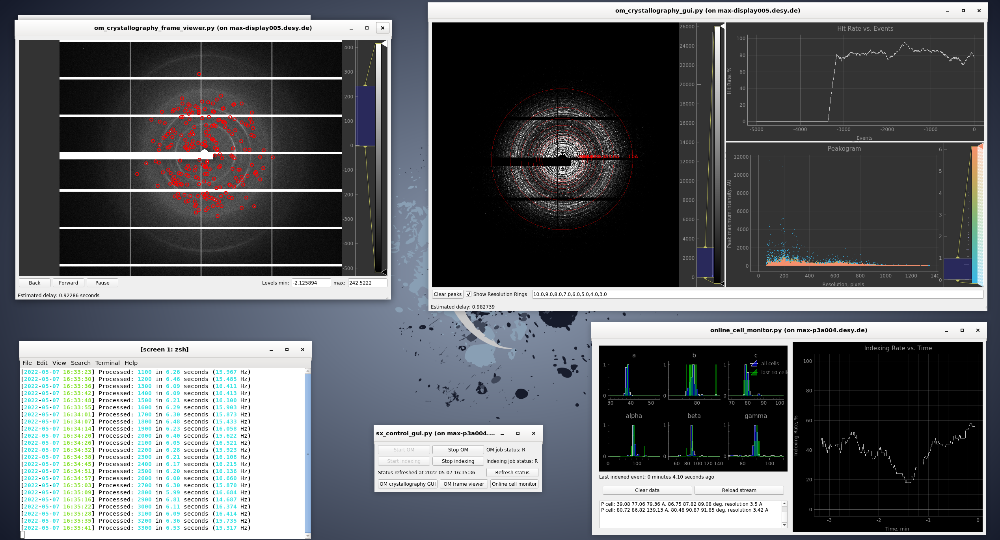

# OM: Online Data Analysis for X-Ray Imaging

## What is OM?

**OM** (**O**nDA **M**onitor) is a framework for the development of programs that can
**monitor** x-ray imaging **experiments** in **real-time**. It is also a set of
ready-to-use monitoring programs.

It is the spiritual successor of the **OnDA Project** and it is maintained mostly by
the same team of developers.

OM offers a set of stable and efficient **real-time monitoring programs** for the most
common types of x-ray imaging experiments. These **can be used immediately** without
modifications or **can be easily adapted** to meet the users’ requirements. In
addition, the project provides a set of modules that can be used to **easily develop**
other monitoring programs, tailored to the characteristics of specific experiments.

OM can process imaging data in the **broadest sense**: multidimensional pixel-based
data (for example: diffraction patterns, photoemission spectrums, images from cameras,
microscopes or x-ray detectors), but also any kind of digital output from an
instrument or sensor (temperature readouts, beam and pulse energies, etc.).

OM focuses on **scalability and portability**, in order to facilitate its adoption
for a wide array of facilities and instruments. It also strives for **stability and
performance**. To achieve these goals, OM processes data in a multi-node parallel
environment, using free and open-source libraries and protocols.

OM is written in **Python**. The use of the Python programming language, which is
particularly suited to rapid development, makes OM **easy to modify** and to adapt to
the requirements of specific experiments.

OM also aims to keep its code base **simple and as small**. The focus is on providing
useful core functionality, while allowing the framework to be expanded with external
software. The goal is to avoid re-implementing algorithms that are already better
optimized in other software packages.

## Recommended Citation

If you use OM in your experiment, please keep citing the original OnDA paper until a
new publication for OM is available:

  Mariani V., Morgan A., Yoon C.H., Lane T.J., White T.A., O'Grady C., Kuhn M., Aplin
  S., Koglin J., Barty A., Chapman H.N., **OnDA: online data analysis and feedback for
  serial X-ray imaging.**, J. *Appl. Crystallogr.* 2016 May 23;49(Pt 3):1073-1080.
  (https://www.ncbi.nlm.nih.gov/pubmed/27275150)

## Source Code

OM is open source software. Its source code is published under the GPLv3 license and
can be found on GitHub in the following repository:

* [OM's source code](https://github.com/omdevteam/om)
